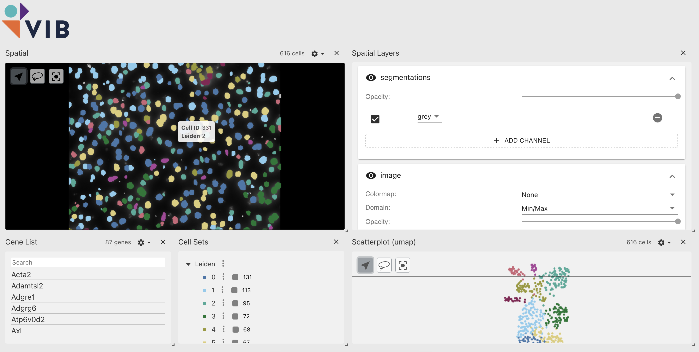

# Vitessce using Project Storage

## Installation

- Open this folder in your terminal
- Install npm

```
npm install
npm install -D vite
```

Run the project
```
npm run dev
```

Open your browser. The Vitessce UI should load. Fill in the access and secret key and the path to the Vitessce config, e.g. `spatial-hackathon-public/_test_vitessce_1/config_resolve.json`. You should see the following:



## Examples

[Visium HD](https://www.10xgenomics.com/datasets/visium-hd-cytassist-gene-expression-libraries-of-mouse-intestine):

https://vib-data-core.github.io/vitessce/?url=spatial-hackathon-public/_test_vitessce_1/config_visium_hd.json

Data preprocessing code and Vitessce config are available [here](./docs/notebooks/visium_hd).

[Xenium](https://www.10xgenomics.com/datasets/preview-data-ffpe-human-lung-cancer-with-xenium-multimodal-cell-segmentation-1-standard):

https://vib-data-core.github.io/vitessce/?url=spatial-hackathon-public/_test_vitessce_1/config_xenium.json

Data preprocessing code and Vitessce config are available [here](./docs/notebooks/xenium).

Resolve:

https://vib-data-core.github.io/vitessce/?url=spatial-hackathon-public/_test_vitessce_1/config_resolve.json

Data preprocessing code and Vitessce config are available [here](./docs/notebooks/resolve).

## Acknowledgement

This codebase is made possible in collaboration with Spatial Catalyst and Saeys Lab.

